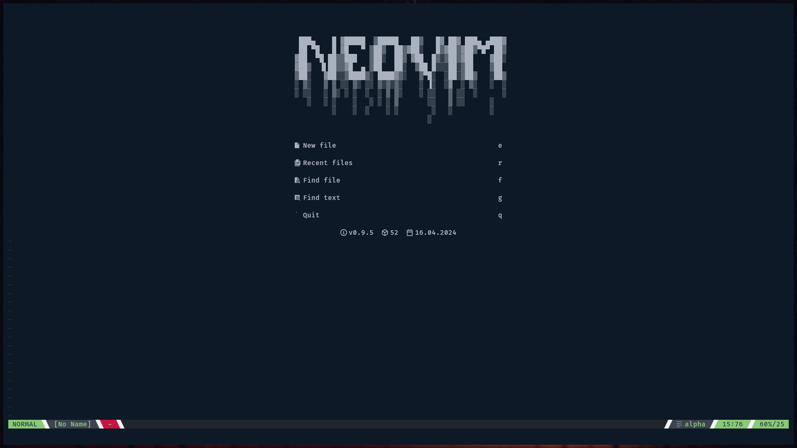
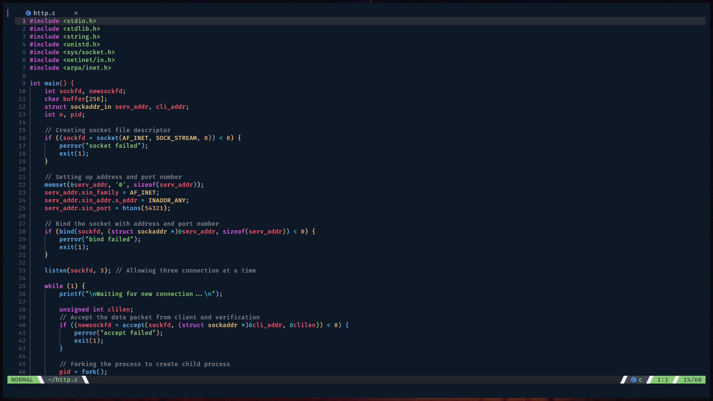

# nvim

##  Setup

```sh
git clone git@github.com:Sanket-Dandge/nvim.git
cp -r nvim ~/.config/
```

-   If there contains a nvim folder already in ```.config``` folder, then move it somewhere else.

##  Appearance




